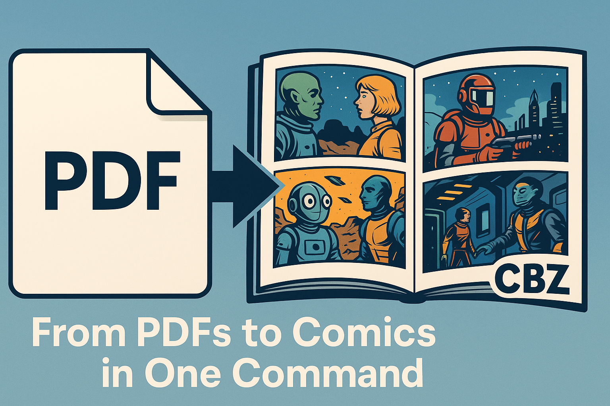

# 📘 PDF to CBZ Converter (`pdf_to_cbz`)

A local advanced converter from PDF to CBZ, with DPI analysis, image format options, configuration management, comprehensive hints system, and enhanced GUI.



> Version `v2.0.0` – Build `20250629`  
> Author: Vincent Cruvellier  
> Compatible with: Windows (requires Poppler), Python 3.9+

---

## ✨ Enhanced Features

### Core Conversion Features
- 🖼️ Convert PDF to CBZ in PNG or JPEG
- 🧠 Auto DPI detection with smart recommendations
- 📏 Manual DPI/quality/image format options
- 🚀 Multi-thread support with auto-detection
- 🧪 DPI analysis mode with size projections
- 🧼 Auto cleanup of temp image folders
- 📝 Comprehensive logging system

### NEW: Configuration Management
- 🔧 **Persistent Settings**: Save and load conversion preferences
- 📋 **JSON Configuration**: Human-readable config files with comments
- � **Smart Defaults**: Automatic optimal value selection
- ⚙️ **CLI Override**: Command line arguments override config settings

### NEW: Enhanced User Experience
- � **Comprehensive Hints**: Built-in guidance and troubleshooting
- 🎯 **DPI Recommendations**: Context-aware optimization tips
- 📷 **Format Guidance**: When to use JPEG vs PNG
- ⚡ **Performance Tips**: Threading and memory optimization
- 🔍 **Troubleshooting Guide**: Common issues and solutions

### NEW: Improved GUI
- 🖥️ **Enhanced Interface**: Smart tooltips and visual indicators
- 🎚️ **Quality Slider**: Visual JPEG quality adjustment
- 🔧 **Config Management**: Save/load settings directly from GUI
- ❓ **Context Help**: Built-in format and optimization guidance
- 📊 **Better Progress**: Enhanced visual feedback

---

## 📥 Installation

### Option 1: Download Pre-built Windows Executables (Recommended)

**For Windows users**, download the latest release from the [GitHub Releases page](../../releases):
- Download `pdf_to_cbz_v{version}_windows.zip`
- Extract the ZIP file
- Run `pdf_to_cbz_gui.exe` for the GUI or `pdf_to_cbz_cli.exe` for command line
- No Python installation required!

### Option 2: Install from Source

#### 1. Clone this repository

```bash
git clone https://github.com/your-username/pdf_to_cbz.git
cd pdf_to_cbz
```

### 2. Install dependencies

```bash
pip install -r requirements.txt
```

### 3. Install Poppler for Windows

- Download: https://github.com/oschwartz10612/poppler-windows/releases
- Add the `bin/` directory to your system `PATH`
- Or use `--poppler-path` to specify location

---

## 🚀 Quick Start

### 1. Get Help and Tips
```bash
# Show comprehensive hints and guidance
python hints.py

# Or get command-specific help
python pdf_to_cbz.py --help
```

### 2. Create Configuration
```bash
# Create sample configuration
python pdf_to_cbz.py --create-config

# This creates ~/.pdf2cbz_config.sample.json
# Copy and customize it to ~/.pdf2cbz_config.json
```

### 3. Basic Usage

#### Command Line
```bash
# Basic conversion with auto-settings
python pdf_to_cbz.py document.pdf

# High-quality conversion
python pdf_to_cbz.py document.pdf -d 200 -f png -q 95

# Analyze before converting
python pdf_to_cbz.py document.pdf --analyse

# Save current settings for future use
python pdf_to_cbz.py document.pdf --save-config
```

#### Enhanced GUI
```bash
# Launch improved GUI
python pdf_to_cbz_gui.py

# Features:
# - Click "Show Hints" for comprehensive help
# - Use "?" button for format guidance
# - Save/Load configurations
# - Quality slider for visual adjustment
```

### 4. Configuration-Based Workflow
```bash
# Use saved configuration with specific overrides
python pdf_to_cbz.py document.pdf -d 300  # Uses config quality/format, CLI DPI

# Custom config file
python pdf_to_cbz.py document.pdf --config my_settings.json
```

---

## 📋 Advanced Usage Examples

### For Comics/Manga
```bash
python pdf_to_cbz.py comic.pdf -d 150 -f jpeg -q 85
```

### For Text Documents
```bash
python pdf_to_cbz.py textbook.pdf -d 200 -f png
```

### Batch Processing with Configuration
```bash
# Set up optimal config first
python pdf_to_cbz.py sample.pdf -d 180 -f jpeg -q 90 --save-config

# Then process multiple files with saved settings
python pdf_to_cbz.py book1.pdf
python pdf_to_cbz.py book2.pdf
python pdf_to_cbz.py book3.pdf
```

---

## 🖥️ Windows Executable Version

If you don't want to install Python or dependencies, compile a standalone `.exe`:

```bash
pyinstaller --onefile pdf_to_cbz.spec
```

Or use the one already in the `dist/` folder:

```bash
pdf_to_cbz.exe sample_dir/ --output-dir out_cbz --auto-dpi
```

> Requires Poppler (`pdftoppm.exe`) in system PATH.

---
Or use the all In one already in the `dist (Full Standalone) /` folder:

```bash
pdf_to_cbz.exe sample_dir/ --output-dir out_cbz --auto-dpi
```

> This Qll In One Version does Requires Poppler (`pdftoppm.exe`) in system PATH.

---

## 🧪 Testing

A `.bat` script is provided to validate all main features:

```bash
test_pdf_to_cbz.bat
```

---

## 📁 Sample Data

- `sample_dir/`: contains sample PDF input
- `out_cbz/`: output CBZ results

---

## � For Developers: Automated Releases

This repository includes an automated release system using GitHub Actions. See [`AUTOMATED_RELEASES.md`](AUTOMATED_RELEASES.md) for details.

**Quick Release:**
```powershell
# Make your changes, then:
.\release.ps1 -Version "2.1.0" -Message "Add new features"
```

The system automatically:
- ✅ Builds Windows executables (CLI + GUI)
- ✅ Creates source packages for all platforms
- ✅ Publishes GitHub release with all artifacts
- ✅ No manual packaging required!

---

## �🛠 Dependencies

- Python ≥ 3.9
- pdf2image
- Pillow
- Poppler for Windows

---

## 📄 License

This project is licensed under the MIT License. See `LICENSE`.

---

## 💬 Credits

Built with ❤️ to make comic collections easier to manage and convert.
