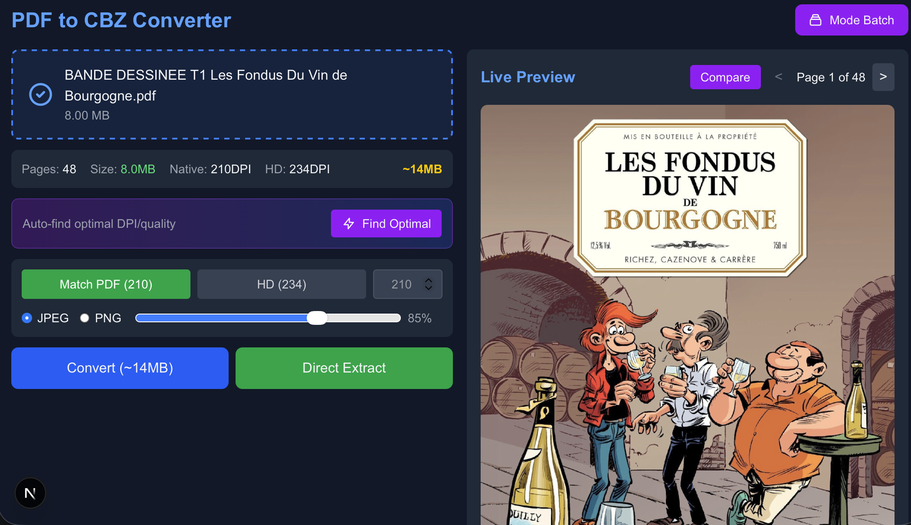
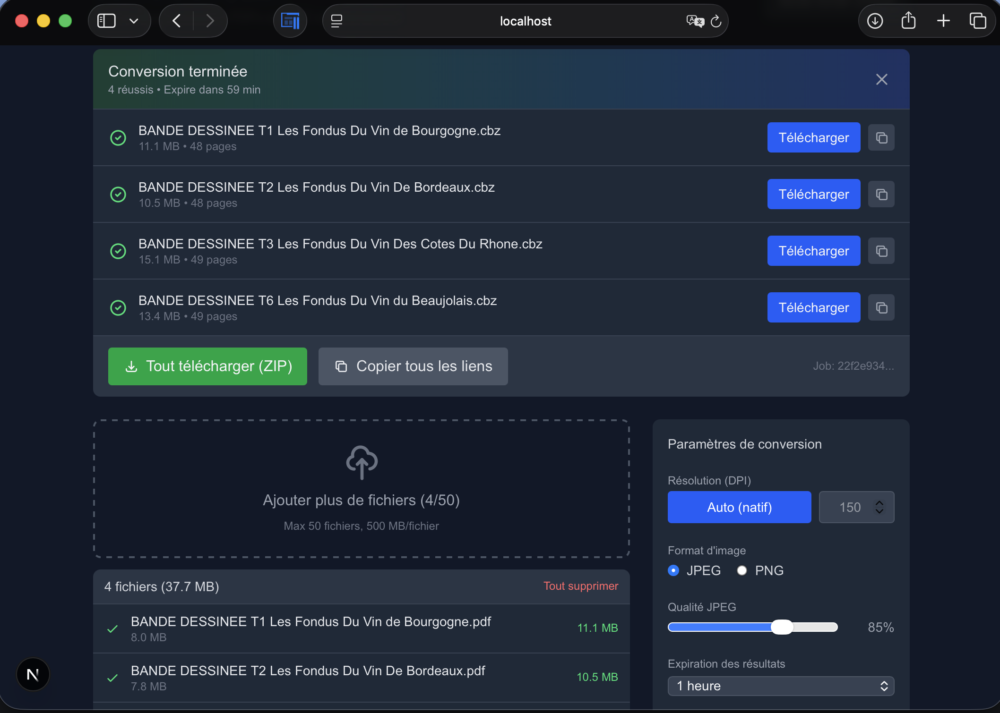

# PDF to CBZ Converter

Bidirectional converter between PDF and comic book archive formats (CBZ, CBR, CB7, CBT). Choose between a modern web application or a cross-platform desktop application.

**Live Demo:** [https://pdf-to-cbz-converter.vercel.app](https://pdf-to-cbz-converter.vercel.app)

## Screenshots

### Single File Mode

*Live preview with adjustable DPI/quality settings and side-by-side comparison*

### Batch Mode

*Convert multiple PDFs at once with progress tracking and bulk download*

## Projects

| Project | Type | Best For |
|---------|------|----------|
| [pdf-to-cbz-nextjs](./pdf-to-cbz-nextjs/) | Web App | Quick conversions, live preview, batch processing, PDF↔CBZ |
| [pdf-to-cbz-python](./pdf-to-cbz-python/) | Desktop App | Large files, offline use, CBZ/CBR/CB7→PDF |
| [Docker](https://hub.docker.com/r/r45635/pdf-to-cbz) | Container | Self-hosted, no size limits |

---

### Web Application (Next.js)

Modern web-based converter deployed on Vercel with **bidirectional conversion**.

**Features:**
- **Bidirectional Conversion:** PDF→CBZ and CBZ→PDF in both single and batch modes
- **Single File Mode:** Live preview, adjustable DPI/quality, side-by-side comparison
- **Batch Mode:** Convert up to 50 files simultaneously with progress tracking
- **Direct Extraction:** Preserve original image quality (no recompression)
- **Multi-language:** English, Français, Español, 中文
- Auto-optimization for optimal file size
- Real-time streaming progress
- Download results individually or as ZIP
- Configurable expiration for batch results (1h default)

**Quick Start:**
```bash
cd pdf-to-cbz-nextjs
npm install
npm run dev
# Open http://localhost:3000
```

**API Endpoints:**
| Endpoint | Description |
|----------|-------------|
| `POST /api/analyze` | Analyze PDF structure |
| `POST /api/analyze-cbz` | Analyze CBZ structure |
| `POST /api/convert` | Convert PDF to CBZ |
| `POST /api/convert-cbz` | Convert CBZ to PDF |
| `POST /api/extract` | Direct PDF to CBZ (no recompression) |
| `POST /api/extract-cbz` | Direct CBZ to PDF (no recompression) |
| `POST /api/batch-convert` | Batch PDF→CBZ (SSE streaming) |
| `POST /api/batch-convert-cbz` | Batch CBZ→PDF (SSE streaming) |
| `GET /api/batch-results/{jobId}` | Get job status and download links |
| `GET /api/download/{jobId}/{fileId}` | Download individual file |
| `GET /api/download-all/{jobId}` | Download all as ZIP |

**Environment Variables (Docker/Self-hosted):**
```bash
BATCH_MAX_FILES=50              # Max files per batch (default: 50)
BATCH_MAX_FILE_SIZE_MB=500      # Max size per file in MB (default: 500)
BATCH_DEFAULT_EXPIRE_MINUTES=60 # Results expiration (default: 60)
```

**Tech Stack:** Next.js 16, TypeScript, Tailwind CSS, pdfjs-dist, Sharp

> **Note:** The [live demo](https://pdf-to-cbz-converter.vercel.app) has a 4.5MB file size limit (Vercel free tier). For larger files or batch processing, run locally or use Docker.

**Docker:** (optimized image ~534MB)
```bash
docker pull r45635/pdf-to-cbz:latest
docker run -p 3000:3000 r45635/pdf-to-cbz:latest
# Open http://localhost:3000
```

Available tags: `latest`, `v2.5.0`

---

### Desktop Application (Python)

Cross-platform desktop converter with GUI and CLI modes.

**Features:**
- **Bidirectional conversion**: PDF→CBZ and CBZ→PDF
- Supports CBZ, CBR, CB7, and CBT formats
- Full-featured GUI with real-time preview
- CLI for scripting and automation
- Configuration management (save/load settings)
- Auto DPI detection with smart recommendations
- Multi-threaded conversion
- Pre-built executables available

**Quick Start:**
```bash
cd pdf-to-cbz-python
pip install -r requirements.txt

# PDF to CBZ (CLI)
python pdf_to_cbz.py document.pdf

# CBZ to PDF (CLI)
python cbz_to_pdf.py comic.cbz

# GUI mode (both directions)
python pdf_to_cbz_gui.py
```

**Requirements:**
- Python 3.9+
- Windows, macOS, or Linux
- tkinter for GUI (see [Python README](./pdf-to-cbz-python/README.md) for installation)

---

## Sample Files

The `sample_dir/` folder contains sample PDF files for testing both applications.

## License

MIT License - See [LICENSE](./LICENSE)

**Author:** Vincent Cruvellier
